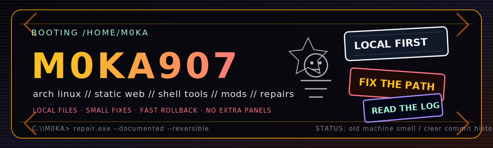
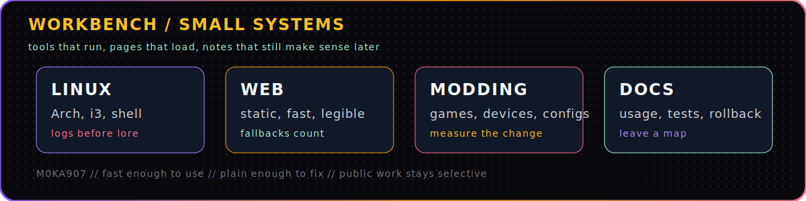

<!--
  M0KA907 profile README.
  GitHub-safe: Markdown + sanitized HTML + repo-local SVGs.
  No scripts. No iframes. No third-party stats cards.
-->

<div align="center">
  
</div>

<div align="center">

# Dawn / M0KA

**Linux systems · static web · shell tools · game/modding workflows · repair-minded docs**

[portfolio](https://m0ka907.github.io/) · [github](https://github.com/M0KA907) · [public workbench](#public-workbench) · [operating-rules](#operating-rules)

</div>

---

```txt
╭─ M0KA907 // login shell ─────────────────────────────────────────╮
│ user      dawn / m0ka                                            │
│ base      alaska                                                 │
│ machine   arch linux, i3, terminal tabs, half-built rigs         │
│ work      useful static sites, scripts, configs, docs, repair    │
│ taste     80s computer room / black metal flyer / photocopy fuzz │
│ rule      make it load, make it legible, make rollback obvious   │
╰──────────────────────────────────────────────────────────────────╯
```

I build small systems that keep working when the polished layer fails: static pages, Linux utilities, repo cleanup, GitHub Pages portfolios, automation handoffs, game configs, device workflows, and repair notes that are still readable later.

<div align="center">
  
</div>

## Workbench

<div align="center">
  
</div>

<table>
<tr>
<td width="50%" valign="top">

### Build

- Static GitHub Pages sites with real fallback content.
- Small Linux tools, package workflows, terminal-first utilities.
- Portfolio/profile systems that do not collapse when an API flakes.
- Agent/Codex/Claude handoffs that turn vague tasks into patchable work.

</td>
<td width="50%" valign="top">

### Repair

- Arch/i3 desktop fixes, shell cleanup, performance triage.
- Retro console/device cleaning and modding workflows.
- PC build planning, troubleshooting, and upgrade advice.
- Game configs, Source/Valve tuning, mod packaging, weird edge cases.

</td>
</tr>
</table>

## Public workbench

| Project | Shape | Why it is here |
|---|---:|---|
| [`M0KA907.github.io`](https://github.com/M0KA907/M0KA907.github.io) | portfolio | Static GitHub Pages surface for public work and client-facing proof. |
| [`Beer`](https://github.com/M0KA907/Beer) | linux toy/tool | Joke command with real packaging habits: small scope, installable, understandable. |
| [`Mokalc`](https://github.com/M0KA907/Mokalc) | utility | Small-tool lab bench; calculator/tooling style repo. |

> WIP repos stay off the front page until they are worth judging.

## Skill board

| Area | I can do | I am sharpening |
|---|---|---|
| Linux | Arch setup, i3 workflow, shell tools, package habits, desktop repair | cleaner one-shot setup scripts and safer rollback paths |
| Web | HTML/CSS/JS, GitHub Pages, static-first UX, mobile cleanup | accessibility, measured performance, failure-state design |
| Automation | agent briefs, repo checks, command workflows, small scripts | cheaper multi-agent loops without token bonfires |
| Hardware | PC parts, repair triage, console/device cleaning and modding | repeatable diagnostics and cleaner service notes |
| Games | configs, modding, performance tuning, Source/Valve weirdness | reusable public config packs and explainers |
| Docs | compact READMEs, usage notes, tests, rollback sections | sharper proof sections and less filler |

<div align="center">
  
</div>

## Operating rules

```txt
01  load before pretty
02  readable before clever
03  static fallback before API garnish
04  one useful file beats six decorative panels
05  delete duplicate UI before adding motion
06  commit small, write rollback, test the ugly path
07  documentation is part of the machine
08  if it needs a dashboard to explain itself, simplify it
```

## Current signal

<details>
<summary><strong>Terminal notes</strong></summary>

```txt
$ ./focus --now
> ship small fixes
> keep websites readable on mobile
> stop stacking effects until the layout works
> build reusable agent harnesses for cheap local/client web work
> keep public repos understandable enough for strangers and tired future-me
```

</details>

<details>
<summary><strong>What to send if you want help</strong></summary>

```txt
problem:        what is broken or what you want built
platform:       windows / arch / phone / github pages / browser / console / other
repo or file:   link it if it exists
constraints:    deadline, budget, device limits, must-not-break items
done means:     the observable finish line
```

</details>

---

<div align="center">

`cheap tools // sharp docs // static pages that survive bad weather`

**[m0ka907.github.io](https://m0ka907.github.io/)**

</div>
